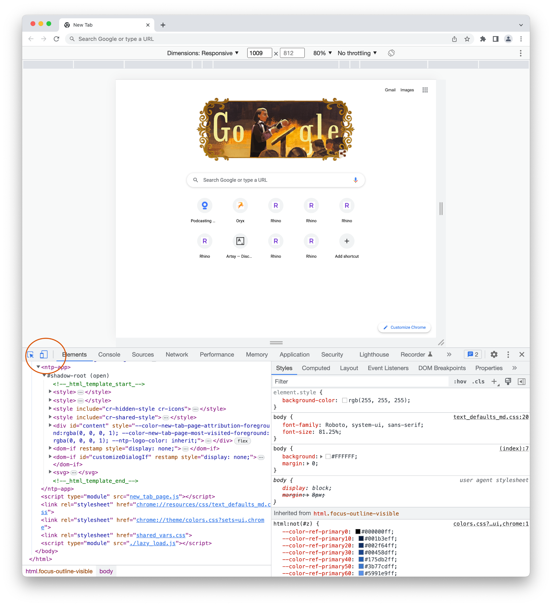
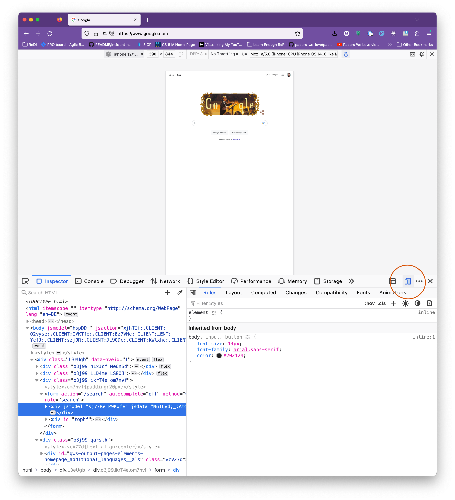

# Responsive Design & CSS Media Queries

## Class Agenda

1. What is Responsive Design?
1. Introduction to Media Queries

## What is Responsive Design? 

Responsive web design is about creating web pages that look good on all devices! A responsive web design will automatically adjust for different screen sizes and viewports.

That is achieved by structuring your HTML and adding CSS such that components of your page are resized appropriately for screen sizes.

It is important to understand that responsive web design isn't a separate technology — it is a term used to describe an approach to web design or a set of best practices, used to create a layout that can respond to the device being used to view the content. These approaches can include:

- Making containers fluid by setting `max-width: 100%`
- Using relative units for typography (`em`, `rem`)
- Using CSS Flexbox or CSS Grid to create layouts that grow and shrink smoothly
- Using media queries to change styles on different viewports

### Relative Units

Relative units are _relative_ to other content on the page. That means that their size is based on the size of something else, usually their parent element.

`%`, `em`, and `rem` are three common helpful units:

- `%` = "Take up % of the parent container"
  - Example: parent element is 400px wide, setting 50% width on the child makes its width 200px
- `em` = "The font size of the parent element (for properties other than font-size) or this element itself (for font-size)"
  - In other words: if you set an element's font-size property like `font-size: 1em`, that means "the same font size as the parent element." If you set any other property like `width: 1em`, that means "the same as this element's font size."
  - Example: parent element has 16px font size, setting `font-size: .75em` on the child makes its font-size 12px
  - Example: parent element has 16px font size, setting `margin: .75em` on the child creates a 12px margin around the element
  - Example: parent element has 16px font size, element itself has `font-size: 12px`. Setting `margin: .75em` on the element itself creates a 9px margin around the element
- `rem` = The font size of the "root element", <html>
  - If you have CSS properties with values set in rem and you change the font size on the <html> element, those elements will adapt!
  - Most browsers have a default font-size of `16px`, so if you don't change this, `1rem` = `16px`

### Testing Responsive Designs

It is extremely important to look at the result of your implementation directly in the browser. As you have already learned, the browser Dev Tools are an excellent way to check and debug your html and css code.

What's more, the browser Dev Tools allow you to check how your page is going to look on different devices such as tablets or mobile phones. Sometimes you can even select from a few built-in device sizes. Use the Dev Tools to check out how your website looks on mobile devices.

<div style="display: flex; flex-direction: row; justify-content: space-between; align-items: center;">
  <div style="width: 49%">
    <h3>Chrome:</h3>
    
  </div>
  <div style="width: 49%">
    <h3>Firefox:</h3>
    
  </div>
</div>

### Responsive images

"Responsive images" means having images that look good on all different devices and viewport widths.

Making images look good at all sizes is often a matter of setting their `width` or `max-width` to `100%`, and possibly wrapping them in a `<div>`.

Here are a few common problems with images and how you can solve them:

- Problem: Image is blurry

  - Usually means the image is small and being displayed at a large size
  - Important: the "actual" image size is not the same as size shown in browser
  - How can you know the "actual" size? Download the image and check!

- Image is stretched or warped

  - Usually because one dimension (height/width) of the image is hardcoded and the other is not

- Image does not change size with page/container

  - Usually because image uses a px width instead of %

- Image is cut off/overflows the container

  - Lots of possible reasons. Might need `width` or `max-width`, or you could use the `object-fit` and `object-position` CSS properties

- Image set using `background-image: url(...)` is not showing the correct part of the image
  - Use a combination of `background-size` and `background-position` properties to resize and reposition it

### Exercise

Solve all of the problems in [this CodePen](https://codepen.io/redi-school/pen/OJBQwON)!

## Introduction to Media Queries

Media queries are a fundamental aspect of creating responsive web designs, which allow websites to adapt to different devices and screen sizes.

We'll explore how media queries work and how you can use them to create layouts that look great on both desktop and mobile devices.

While desktop computers were once the primary way people connected to the internet, the rise of smartphones has dramatically changed the game. Today, most people use their smartphones to access the internet. Mobile internet usage has surpassed desktop usage in recent years, and this trend is only expected to continue.

Your job, as a web developer, is to develop websites that work seamlessly across a variety of devices, including smartphones and tablets. We’re going to look at a concept called Media Queries, which will help us to do this.

### Using Media Queries

A media query is a conditional statement that checks certain conditions (such as screen size, device orientation, or aspect ratio) and applies a set of CSS styles based on those conditions.

For example, a media query could apply different font sizes or layout styles to a website when viewed on a smartphone device versus a laptop.

Media queries work by using the "@media" rule in CSS, which specifies a set of styles to apply when certain conditions are met.

Developers can use a variety of conditions to trigger a media query, such as "max-width", "min-width", "orientation", and "device-pixel-ratio".

```css
@media screen and (min-width: 768px) {
  body {
    font-size: 20px;
  }
}
```

### Example

[CSS Media Queries Demo](https://codepen.io/redi-school/pen/QWZaeJP)

### The viewport tag

The viewport HTML meta tag is important for accurate media queries because it helps the browser determine the size of the viewport (the visible area of the webpage).
Some mobile devices and other narrow screens render pages in a virtual window or viewport, which is usually wider than the screen, and then shrink the rendered result down so it can all be seen at once.

<meta name="viewport" content="width=device-width, initial-scale=1" />

Without this tag, the browser may use a default viewport size, which can cause media queries to work incorrectly.

### Exercises

- Exercise 1: [CodePen](https://codepen.io/redi-school/pen/RwvLYOz?editors=1100)
- Exercise 2: [CodePen](https://codepen.io/redi-school/pen/QWYqZqq?editors=1100)

# Homework

1. (15 - 30min) Using pencil and paper, create a mobile-first design (in other words: draw it for a phone screen, then for a desktop) for a news webpage with the following elements:
    1. Navigation bar
    1. Main section
        - Contains at least two different “types” of section, e.g. ⅓ + ⅔ with image and text and a three-column layout
    1. Footer
1. (90 - 120min) Implement your design, starting with the mobile view. Focus on making one complete element (i.e. nav, section 1, section 2, footer) at a time so you get practice with media queries!

# Glossary & Terminology

- `Responsive Web Design` - Responsive web design (RWD) is an approach to web design that makes web pages look good on a variety of devices and window or screen sizes from minimum to maximum display size. More info [here](https://en.wikipedia.org/wiki/Responsive_web_design).
- `Viewport` - [The user's visible area of a web page](https://www.w3schools.com/css/css_rwd_viewport.asp)
- `Breakpoint` - The viewport width at which the layout changes
- `CSS at-rule` - An instruction that ‘tells’ css how to behave. For example, `@media` instructs the CSS that it should only apply the media queries content if the device meets the criteria of the condition/s.
- `media type` - Describes the device category, for example `screen`, `print`, or `all`.
- `media feature` - Describe specific characteristics of the device, such as min-width or max-width.

# Resources

- [MDN Responsive Design](https://developer.mozilla.org/en-US/docs/Learn/CSS/CSS_layout/Responsive_Design)
- [W3S Responsive Design](https://www.w3schools.com/html/html_responsive.asp)
- [Using Media Queries](https://developer.mozilla.org/en-US/docs/Web/CSS/Media_Queries/Using_media_queries)
- [What is Mobile First Design](https://medium.com/@Vincentxia77/what-is-mobile-first-design-why-its-important-how-to-make-it-7d3cf2e29d00)

# Slides

<iframe src="https://docs.google.com/presentation/d/e/2PACX-1vR5eT0kbHjnErRPucTw_70Mx9cSiqu3Os99HwfToclD5T0C2KVUU481P5a8oCI71k8XpcOgio0Eiu5P/embed" frameborder="0" width="960" height="569" allowfullscreen="true" mozallowfullscreen="true" webkitallowfullscreen="true"></iframe>
